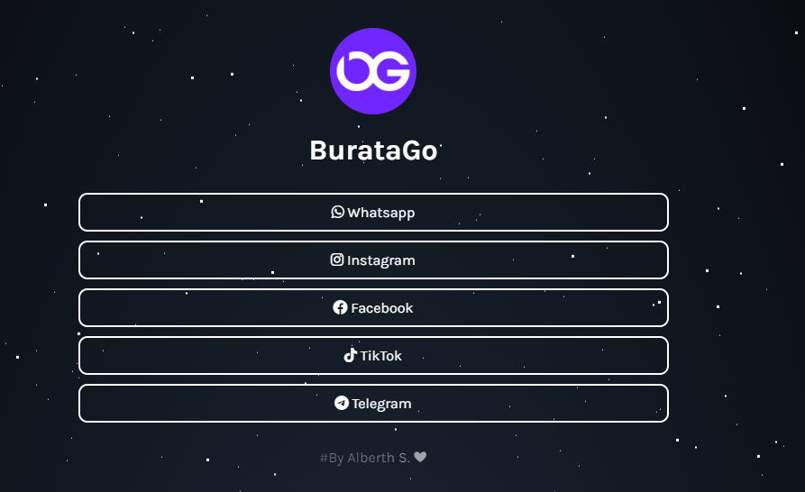

<h1 align="center">💸 BurataGo</h1>
<h3 align="center">La forma más segura y rápida de enviar dinero a tus seres queridos.</h3>

<p align="center">
  
  
  <a href="https://www.linkedin.com/in/alberth-s/">
    
  </a>
  
  
  
  <a href="https://github.com/Shadelight/buratago/commits/gh-pages">
    
  </a>
</p>

<p align="center">
  <a href="#-sobre-el-proyecto">Sobre el proyecto</a>&nbsp;&nbsp;&nbsp;|&nbsp;&nbsp;&nbsp;
  <a href="#-empezando">Empezando</a>&nbsp;&nbsp;&nbsp;|&nbsp;&nbsp;&nbsp;
  <a href="#-cómo-contribuir">Cómo contribuir</a>&nbsp;&nbsp;&nbsp;|&nbsp;&nbsp;&nbsp;
  <a href="#-licencia">Licencia</a>
</p>

---

<p align="center">
  
</p>

---

## 💡 Sobre el proyecto

BurataGo es tu casa de cambio confiable, rápida y segura para enviar dinero a tus seres queridos.
- [Demo](https://Shadelight.github.io/buratago)

## 🚀 Empezando

Si has instalado git, puedes clonar el código en tu máquina, o descargar un ZIP con todos los archivos directamente.
[Descargar el ZIP desde esta ubicación](https://github.com/Shadelight/buratago/archive/gh-pages.zip), o ejecuta el siguiente comando [git](https://git-scm.com/downloads) para clonar los archivos en tu máquina:
```bash
git clone https://github.com/Shadelight/buratago
